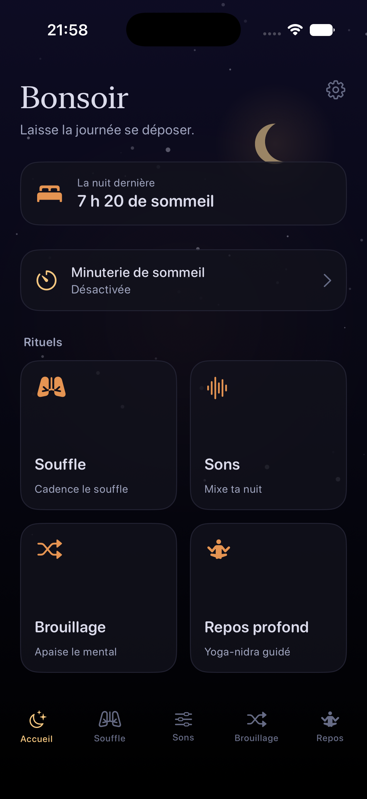
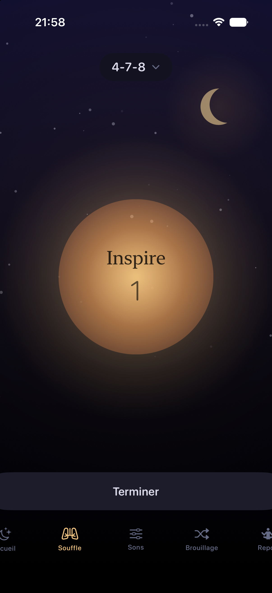
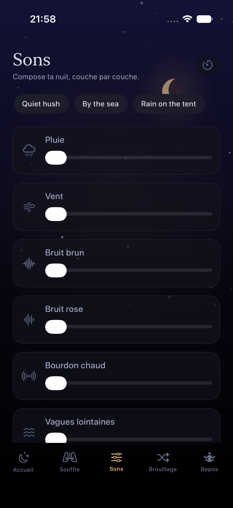
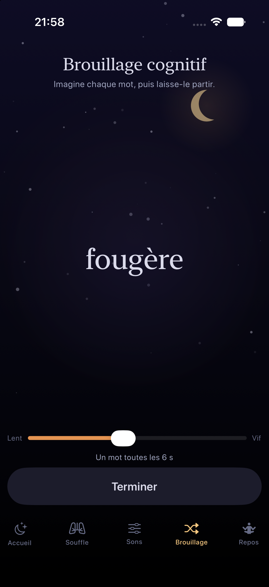
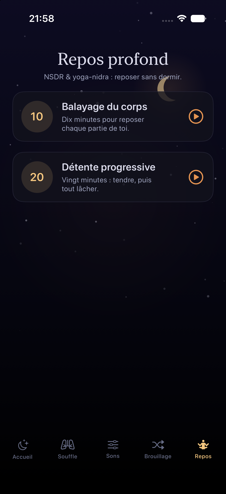
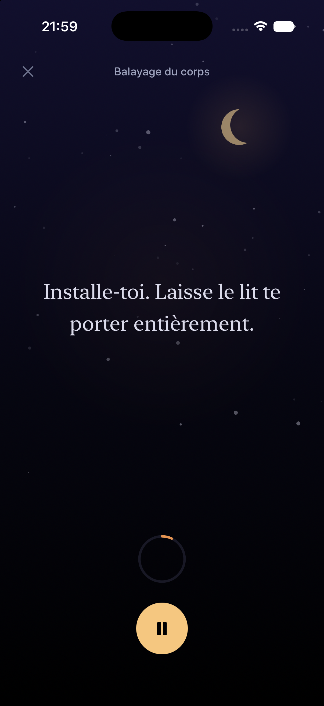

# La Berceuse 🌙

A native iOS **sleep instrument** — a lullaby for the racing mind. La Berceuse
helps you fall asleep with wind-down rituals, breath pacing, a cognitive shuffle,
fading procedural soundscapes, and guided deep rest. True-black, very dim,
one-handed in the dark, **fully offline**, and it keeps playing under lock.

Sixth app in Jac's Atelier / "La Shop" family. French-first (FR/EN), SwiftUI,
SwiftData, AVAudioEngine, HealthKit.

<p>
  
  
  
</p>
<p>
  
  
  
</p>

## What it does

- **Le souffle — breathing-orb pacer.** A warm amber orb expands and contracts on
  exact pacing math, with selectable patterns: **4-7-8**, **box / carré**,
  **coherent 5.5 / cohérence cardiaque**, and the **physiological sigh / soupir
  physiologique**. Phase word + count, gentle breath-paced haptics (device-only),
  reduced-motion safe.
- **Le brouillage cognitif — cognitive shuffle.** A scientifically-grounded
  sleep-onset technique (Beaudoin's serial-diverse imagining): a slow stream of
  unrelated, emotionally-neutral words, shown large and softly spoken via on-device
  speech (`AVSpeechSynthesizer`, slow/low voice). Curated FR + EN neutral-noun word
  banks with a deterministic-but-varied shuffle (no repeats within a pass).
- **Les sons — generative soundscape mixer.** Procedural `AVAudioEngine` layers,
  **no audio files**: rain, wind, brown noise, pink noise, a warm drone, distant
  waves, and a music-box lullaby motif — each with its own volume. Save favourite
  mixes. A **sleep timer** (15/30/45/60/90 min or custom) **fades the audio to
  silence** on an equal-power curve, then stops the engine. Keeps playing under
  lock (background audio).
- **Le repos profond — NSDR / yoga-nidra.** Guided body-scan and progressive-
  relaxation scripts, revealed line-by-line at a calm pace with optional soft TTS,
  timed (10 / 20 min).
- **HealthKit.** Asks permission, shows last night's sleep as a gentle stat, and
  logs each wind-down ritual to Health as in-bed / mindful time. Fails gracefully
  when denied or unavailable.
- **Design.** True-black OLED ground, a slow breathing indigo→black sky with a low
  warm moon and drifting stars, amber accents, a quiet serif/rounded font pairing.
  Adjustable dimness. Reduced-motion safe throughout.
- **Persistence (SwiftData).** Favourite mixes, ritual history, and settings.
- **Fully offline.** No network, no AI calls.

## Build & run

Requires Xcode 27+, [`xcodegen`](https://github.com/yonaskolb/XcodeGen), and Python 3
with Pillow (for the app-icon generator).

```bash
./gen.sh        # regenerate LaBerceuse.xcodeproj + refresh the app icon set
```

**Simulator (Debug):**

```bash
xcodebuild -project LaBerceuse.xcodeproj -scheme LaBerceuse \
  -configuration Debug \
  -destination 'platform=iOS Simulator,name=iPhone 17 Pro' \
  -derivedDataPath /tmp/la-berceuse-dd build
```

**Tests** (breath-pacing math, cognitive-shuffle generator, fade-curve, sleep-timer,
nidra pacing — 25 tests):

```bash
xcodebuild -project LaBerceuse.xcodeproj -scheme LaBerceuse \
  -destination 'platform=iOS Simulator,name=iPhone 17 Pro' \
  -derivedDataPath /tmp/la-berceuse-dd test
```

### Screenshot / demo launch flags

The app honours launch arguments so screens can be captured without taps:
`-demoLang fr|en`, `-demoTab home|breath|sound|shuffle|nidra`, `-demoRun`
(auto-start breath/shuffle), `-demoNidra` (open a player), `-demoTimer`,
`-demoSleep`, `-demoNoHealth`.

## Device

`com.apple.developer.healthkit` is in the entitlements (required — usage strings
alone are not enough), and `audio` is in `UIBackgroundModes` so soundscapes keep
playing with the screen locked. Install a signed Release build to a connected,
unlocked iPhone (Developer Mode on, signed into team `9WZ66DZ69J`):

```bash
./install-device.sh
```

The script builds **Release** with DerivedData in `/tmp` (out of iCloud) to avoid
the two classic native-build traps: iCloud extended attributes breaking
`codesign`, and Debug `*.debug.dylib` stubs failing to install standalone.

**Device-only vs simulator:** real haptics and HealthKit reads/writes are
device-only (guarded behind `#if !targetEnvironment(simulator)` / availability
checks); the simulator shows the HealthKit permission flow but returns no sleep
data. Everything else — the breathing pacer, the generative soundscapes (audible),
the cognitive shuffle with spoken words, NSDR playback, the sleep-timer fade — runs
in the simulator.

> Note: a fully **signed** Release build needs a provisioning profile that includes
> the HealthKit capability for `app.atelier.laberceuse`. If `xcodebuild` reports
> "agree to the latest Program License Agreement", sign in at developer.apple.com,
> accept the new agreement, then re-run `./install-device.sh` so Xcode can generate
> the profile.

## Layout

```
Sources/
  Util/      Loc.swift (FR/EN), Theme.swift, Haptics.swift
  Models/    BreathPattern, CognitiveShuffle, Soundscape (+ FadeMath/SleepTimer),
             NidraScript, Persistence (SwiftData), SleepTimerController, DemoSeed
  Audio/     SoundEngine.swift  (procedural AVAudioEngine mixer)
  Speech/    Narrator.swift     (AVSpeechSynthesizer)
  Health/    SleepHealth.swift  (HealthKit)
  Views/     NightSky, RootView, HomeView, BreathView, SoundscapeView,
             ShuffleView, NidraView, TimerSheet, SettingsView
Tests/       LaBerceuseTests.swift
iOS/         Info.plist, LaBerceuse.entitlements, {fr,en}.lproj/InfoPlist.strings
scripts/     gen-appicon.py  (opaque moon-over-indigo icon, no alpha)
```

Bonne nuit. 🌙
